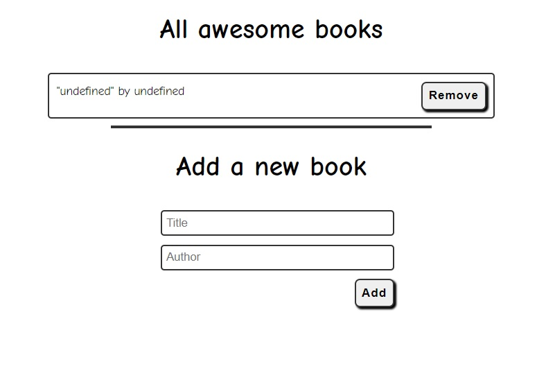

# todo-list

In this project, we will build a basic website that allows users to add/remove tasks to  a todo list.
We will use webpack to bundle our code and use a dynamic web server to run the application.
This project has the following features: add/remove tasks, mark tasks as complete, and display all tasks. Also it has a UI that allows users move up and down the list items.

<!-- todo: Update the image  -->

Additional description about the project and its features.

## Built With

- Major languages:
  - HTML
  - CSS
  - JavaScript ( ES6 )
  - GIT
  
  - Technologies used:
  - VScode
  - GitHub
  -  NPM
  -  webpack
  -  windows 10 0S
  -  Kubuntu 21.04 OS
  - node  
## Live Demo
<!-- todo: Go live and update the link -->
<!--  -->

## Getting Started

To get a local copy up and running follow these simple example steps.

### Setup
- Use the green "Code" button at the top of the repo
- Open a terminal or a git bash in the desired directory and run git clone git@github.com.sergiogval/todo-list.git
- Alternatively, use GitHub Desktop to clone the repository locally or
- Download this repository's zip file to your machine
- When you double click on your index.html file, it should open in the browser

## Author

👤 **Sergio Valadez**

- GitHub: [@sergiogval](https://github.com/sergiogval)
- Twitter: [@srgvldz](https://twitter.com/srgvldz)
- LinkedIn: [LinkedIn](https://www.linkedin.com/in/sergio-valadez-282153216/)
- Instagram: [@sergioval](https://www.instagram.com/sergioval/)

## 🤝 Contributing

Contributions, issues, and feature requests are welcome!

Feel free to check the [issues page](https://github.com/sergiogval/pachage-js/issues).

## Show your support

Give a ⭐️ if you like this project!

## Acknowledgments

- Hat tip to anyone whose code was used
- Inspiration
- etc

## 📝 License

This project is [MIT](./MIT.md) licensed.
